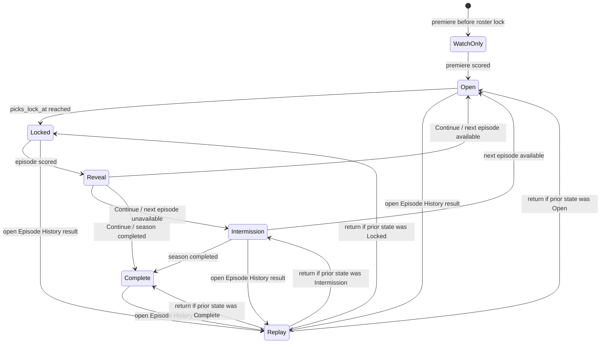

# My Season state-based redesign

**Status:** Direction agreed; state model defined; interaction and visual design still exploratory  
**Last updated:** 2026-08-11

## Why this exists

The current My Season experience presents too many questions at the same time and at nearly the same visual weight. Repeated bordered cards, small type, and status pills force users to read the whole page to understand what matters now.

The redesign organizes My Season around the episode lifecycle. The week is not one page with a different status label; it changes posture according to what the player can or wants to do.

## Product model that the UI must preserve

### Roster

The roster is the player's active group of castaways. Points come from what those castaways do in the episode: challenges, tribal voting, idols, advantages, placement, and other configured scoring events.

Roster scoring is separate from the player's elimination predictions.

### Ballot

The ballot contains the castaways the player predicts will be eliminated that episode.

- Episodes 2–5 normally allow up to three picks.
- Episodes 6–10 normally allow up to two picks.
- Episodes 11–13 normally allow one pick.
- The episode row remains authoritative through `max_elimination_picks`.
- Correct elimination picks earn the configured prediction points; incorrect picks earn zero.
- An episode may eliminate more than one castaway. Each correct ballot pick scores independently, so one player may have multiple correct picks in the same episode.
- The finale uses its separate three-part finale ballot.

### Weekly play

Each player receives one optional play per episode. It does not carry over.

The play can be used for one of three purposes:

1. **Double Castaway Points** — choose one active roster member; that castaway's roster points for the episode count twice.
2. **Double Vote Points** — every correct elimination pick on the episode ballot counts twice, including when an episode has multiple eliminations. It does not add another pick and does not target one ballot selection.
3. **Roster Swap** — after the season's configured free swaps have been used, a swap consumes that episode's weekly play. A free swap does not consume the play.

The weekly play connects the roster and ballot systems, but it is not owned by either one. The UI should present it as a parallel weekly decision rather than nesting the entire mechanic inside the ballot or roster.

## State model

The screen has a durable **base state** derived from season and episode data. Reveal is a temporary presentation layer over that state, not another week in the schedule. This distinction lets a scored episode produce a meaningful reveal and then continue directly into the next open episode.

### Base states

| State | Entry condition | Player's job | Exit condition |
| --- | --- | --- | --- |
| **Watch only** | An unscored episode before the roster lock still blocks play | Follow the premiere; no fantasy decisions are available yet | The watch-only episode is scored and the first playable episode opens |
| **Open** | A playable episode exists and `picks_lock_at` is in the future | Complete the ballot, optionally use the weekly play, and make any permitted roster swap | The episode reaches `picks_lock_at` |
| **Locked** | The current playable episode is locked but not scored | Watch; review what was committed | An administrator scores the episode |
| **Intermission** | No episode is open or awaiting scoring, but the season is not complete | Wait for the next episode to become available | A new episode opens or the season is completed |
| **Complete** | The season has been explicitly marked completed | Review final standings and episode history | Terminal state |

`Watch only` has precedence over `Open`. This preserves the current premiere behavior: a later episode may technically satisfy the open-episode helper while the pre-roster-lock premiere is still underway.

The locked state is data-driven, not clock-window-driven. If scoring is delayed, the screen stays locked and read-only even after the broadcast ends. The dark, torchlit treatment can be time-limited without changing the underlying permissions.

### Reveal layer

Reveal has two modes:

- **Automatic reveal** appears for the latest newly scored playable episode that the player has not acknowledged. Its return state is whatever the resolver currently computes—normally the next episode's Open state, but sometimes Intermission or Complete.
- **Replay reveal** is launched deliberately from Episode History. Closing it returns to the screen the player came from and does not modify acknowledgement state.

An automatic reveal is acknowledged only when the player selects Continue or explicitly dismisses it. Merely loading the route does not count. Acknowledgement should be stored server-side per player and season so the experience is consistent across devices.

If a player misses several episodes, automatically reveal only the latest unseen result. Older scored episodes remain available in Episode History rather than forcing the player through a queue of stale reveals.

The watch-only premiere does not receive an automatic fantasy reveal because it has no player roster or ballot scoring. Completed historical seasons should not begin auto-revealing old episodes after this feature ships.

### Resolver order

Do not render a state until the season, episode, and reveal-acknowledgement data needed by the resolver are loaded. This avoids a flash of Open controls before the app discovers that an episode is locked or a reveal is due.

1. Resolve the base state:
   1. `Complete` when the season is explicitly completed.
   2. `Watch only` when an unscored pre-roster-lock episode blocks play.
   3. `Open` when `openEpisode` returns an episode.
   4. `Locked` when `airingEpisode` returns an episode.
   5. `Intermission` otherwise.
2. Find the latest scored playable episode eligible for automatic reveal.
3. If that episode has not been acknowledged, present its Reveal over the base state.
4. Otherwise render the base state.

The UI must use the same resolved state for composition and permissions. Visual treatments must never become a second source of truth for whether ballot, play, or roster controls are editable.

### Transitions

### State-specific privacy and edge cases

- Aggregate pick popularity is available only inside a scored reveal or scored history result. It is never sent to or shown by Open and Locked views.
- Episode-specific league insights are optional and administrator-selected. Reveal must not assume a fixed statistic set or render empty placeholders when none were configured.
- Other players' individual ballots remain governed by the existing post-lock visibility rules; that does not make aggregate popularity available before scoring.
- A player who submitted no ballot still receives a reveal, with zero ballot points stated plainly rather than treated as an error.
- A player who used no weekly play sees that no bonus was applied. The reveal must not imply a missing or failed action.
- A scored episode with no next episode row transitions from Reveal to Intermission.
- A delayed scoring job leaves the episode in Locked; it does not open the following episode early.
- The finale uses the same lifecycle: Open, Locked, Reveal, then Complete. Its separate ballot structure does not require a separate page state.
- If trustworthy prior-rank data is unavailable, show episode points and current rank but omit rank movement rather than estimating it.

### Open-state substates

Open contains several independent pieces of progress; they are not additional page states:

- **Ballot:** empty, unsaved changes, or saved; editable until lock.
- **Weekly play:** unused, Double Castaway Points with a target, Double Vote Points, or consumed by a paid roster swap.
- **Roster swap:** unavailable, free, or weekly-play-funded. A free swap does not change the weekly-play substate.

Keeping these substates independent prevents the UI from implying that the roster, ballot, and weekly play are versions of the same control.

## State compositions

### 1. Open — make and save decisions

The main job is the current episode ballot.

Show:

- episode number and lock time;
- the number of permitted ballot picks and current selection count;
- eligible castaways, grouped in a scan-friendly way;
- a clear save/edit state;
- the active roster as a compact reference;
- the optional weekly play as one distinct decision with accurate consequences;
- roster-swap access only when applicable, with the free-swap distinction preserved.

Hide or move away:

- past episodes;
- play history and retired token ledger;
- detailed season-long roster breakdowns;
- other players' picks and aggregate pick popularity;
- scored-episode analysis.

The Open view should be designed mobile-first as one vertical flow. Avoid side-by-side ballot and play panels on phone-sized screens.

### 2. Locked / airing — watch

There is nothing editable to do. The whole screen should communicate that fact rather than rendering disabled versions of the Open controls.

Show:

- the saved ballot, visibly committed;
- the active roster, still in play;
- the weekly play that was used, or that none was used;
- when scoring is expected;
- a restrained torchlit/night treatment during the airing window.

Hide:

- editable ballot controls;
- advantage buttons and selectors;
- roster edit and swap controls;
- detailed reference/history sections.

The night treatment should feel like a short weekly event, not the permanent application theme.

### 3. Reveal — understand what happened

Reveal is a post-score event, not a durable replacement for the next Open episode.

On the player's first visit after scoring, show:

- who was eliminated;
- which ballot picks were correct;
- roster points, preferably broken down by roster member;
- elimination-pick points;
- the weekly play's effect and bonus earned;
- total episode points;
- rank movement;
- post-score comparison statistics, such as the percentage of players who picked the eliminated castaway or performance versus the league median.

The comparison area is an optional, episode-specific editorial module rather than a fixed pair of statistics. An administrator can choose the interesting post-score facts for that episode—for example pick popularity for one or more eliminated castaways, the percentage with multiple correct picks, use of a consequential weekly play, or performance versus the league median. If no insight is selected, the module is omitted rather than filled with generic statistics.

Ballot results must support zero, one, or several correct picks. When multiple castaways are eliminated, show each actual elimination and the result of every ballot pick. Ballot points are the sum of all correct picks; Double Vote Points then adds an equal bonus across that complete correct-pick total.

Pick percentages and similar crowd information must not appear before the episode is scored.

After acknowledgement, continue to the next episode's Open view when one exists. If the next episode is not available, settle into a quiet intermission state. The reveal remains replayable from Episode History.

## Information hierarchy

The three scoring lanes should remain legible on Reveal:

1. **Roster earnings** — what the player's active castaways did.
2. **Ballot earnings** — which elimination predictions were correct.
3. **Weekly-play bonus** — the extra points or roster change created by the chosen play.

Do not collapse these into ambiguous labels such as "your picks" or visually imply that the roster and ballot are the same set of contestants.

## Copy direction

Task screens should use direct product language rather than generic hype copy.

Prefer labels such as:

- Episode 10 picks
- Your ballot
- Pick up to two castaways
- Weekly play (optional)
- Save picks
- Editable until Wednesday at 7:30 PM CT

Reserve the more theatrical voice for the Locked and Reveal moments. Avoid phrases that obscure the actual rule or make the weekly play sound like a different mechanic.

## Visual direction

The leading direction is an editorial, broadcast-night identity:

- warm daylight surfaces while decisions are open;
- a genuine dark, torchlit airing state;
- large display typography carrying hierarchy instead of repeated borders;
- fewer containers and almost no nested cards;
- state expressed through composition, available actions, lighting, and type—not equal-weight status pills;
- a short reveal beat with visible points and rank movement.

Build on the shipped Borneo-inspired palette in `frontend/src/index.css`: ocean, jungle, sand, and ember. Anton remains the display workhorse and Skranji is reserved for the brand lockup.

## Data and implementation implications

- The episode-state primitives already exist in `frontend/src/lib/episodes.ts`: `openEpisode`, `airingEpisode`, and `episodeClosed`.
- Add one shared My Season resolver around those primitives instead of repeating precedence rules inside presentation components.
- The current My Season page already loads roster scoring, elimination-pick results, standings, and advantage plays.
- Automatic reveals require a server-backed per-player acknowledgement of the latest revealed scored episode. Replays do not update it.
- Reveal results should be server-authoritative, including prior and current rank when rank movement is displayed.
- Aggregate post-score statistics may require a new authenticated backend response. It must reveal nothing before the applicable lock/score boundary.
- Completed seasons are historical snapshots; new presentation must not change their scoring.

## Open questions

- Exactly when should the torchlit treatment begin and end?
- Which insight types and authoring controls should the first administrator-facing version support?
- Where should replayable Episode History live in the final navigation?
- How much roster detail belongs in Open versus a separate roster surface?
- How should the state-based mobile hierarchy expand on desktop without returning to a dashboard of equal-weight panels?

## Non-goals for this phase

- Changing scoring values or gameplay rules.
- Reintroducing tokens or Extra Vote.
- Redesigning admin scoring entry.
- Finalizing production copy before the interaction model is approved.
- Treating exploratory mockup numbers or contestant names as canonical data.

## References

- `../../fantasy-survivor-design.md`
- `../CLAUDE.md`
- `../frontend/src/index.css`
- `../frontend/src/pages/MySeasonPage.tsx`
- `../frontend/src/lib/episodes.ts`
- `../frontend/src/lib/advantages.ts`
- `../backend/app/routers/advantage_plays.py`
