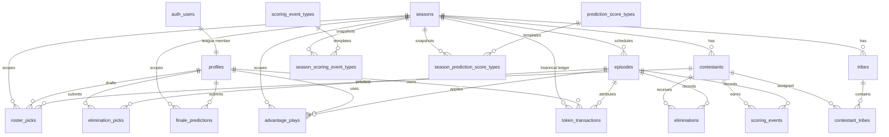

# Database schema map

The ordered SQL migrations in [`../supabase/migrations/`](../supabase/migrations/)
are canonical. This page is a navigation map for the current schema; it should
not reproduce every column or constraint.

## Relationships



`auth_users` denotes Supabase's `auth.users`; it is not a public-schema table.
Contestant references on finale predictions and weekly plays are omitted from
the diagram to keep the central relationships readable.

## Tables by responsibility

| Area | Tables | Role |
| --- | --- | --- |
| Membership | `profiles`, `leagues`, `league_members`, `league_seasons` | Who a person is, which leagues they belong to, and which seasons each league plays. Each league has its own join code; a `league_seasons` row is one league playing one season and carries that league's rule knobs (roster size, lock episodes, swap economy) (#595). `profiles.id` is the matching `auth.users.id`. `is_admin` grants admin tooling; `is_player` (separate, #471) marks league participation; `is_bot` marks a practice-bot account (the bot driver's roster), so a commissioner can hold admin access and still be scored. Standings/scoring filter on `is_player`, not `is_admin`. |
| Season structure | `seasons`, `episodes`, `contestants`, `tribes`, `contestant_tribes` | The show, shared by every league playing it: schedule, cast, current/effective tribe assignments, merge, lifecycle status, and lock timestamps. Rule knobs live on `league_seasons`. |
| Episode facts | `eliminations`, `scoring_events` | Commissioner-reviewed facts about what happened. Placements on `contestants` synchronize finale placement events through database triggers. `eliminations.is_final` is false for a Redemption Island boot (#655): the ballot scores the row, but "out of the game" everywhere else means an elimination with `is_final`; the terminal exit is `redemption_loss`. `tribes.is_redemption` marks the island tribe the survivoR sync creates, whose residents are hidden from the ballot. |
| Player decisions | `roster_picks`, `elimination_picks`, `finale_predictions`, `advantage_plays` | Effective-dated rosters, weekly ballots, the finale ballot, Sole Survivor flag, weekly doubles, and paid-swap play records. |
| Global templates | `scoring_event_types`, `prediction_score_types`, `advantage_types` | Defaults for future seasons and the current advantage menu. They are not the scoring source for an existing season. |
| Season snapshots | `season_scoring_event_types`, `season_prediction_score_types` | Immutable-in-practice copies created with each season so later tuning cannot rewrite history. |
| Historical compatibility | `token_transactions` and token-era columns on `seasons`, `advantage_plays`, and `roster_picks` | Keeps completed token seasons and old swap/double behavior explainable. `seasons.token_economy_enabled` explicitly distinguishes those rules from the current weekly-play model. |

The retired `winner_picks` table was dropped. The current endgame uses
`finale_predictions` plus `roster_picks.is_sole_survivor`.

## Access and integrity boundaries

- RLS is enabled on every public application table with no client-facing
  policies. The FastAPI service-role connection is the only application data
  path; React never queries Supabase tables directly.
- Every API route except `/health` authenticates a Supabase JWT. Owner, lock,
  and administrator checks live in the backend and are not delegated to UI
  visibility.
- Foreign keys generally cascade season/episode/member deletion into dependent
  rows. Do not infer that a broad delete is operationally safe; production
  data changes still go through reviewed migrations or API actions.
- Scoring facts are append-oriented. Scoring-event corrections use the focused
  delete endpoint, and historical token reversals are guarded against negative
  balances.

## Rebuild and inspect

With Docker running, reconstruct the schema from migrations in the disposable
local Supabase database:

```bash
supabase start
supabase db reset --local
supabase migration list --local
supabase db dump --local --schema public --file supabase/.temp/current-schema.sql
```

`db reset` deletes and recreates only the local Supabase database, then applies
all migrations and `supabase/seed.sql`. The generated dump is inspection
output under the ignored `supabase/.temp/` directory; never edit it as a schema
source.

When a migration changes relationships or the historical-compatibility model,
regenerate the dump, compare it with the migrations, and update this map in the
same pull request. For production drift checks, use `supabase migration list
--linked`; do not dump secrets or production data into the repository.
