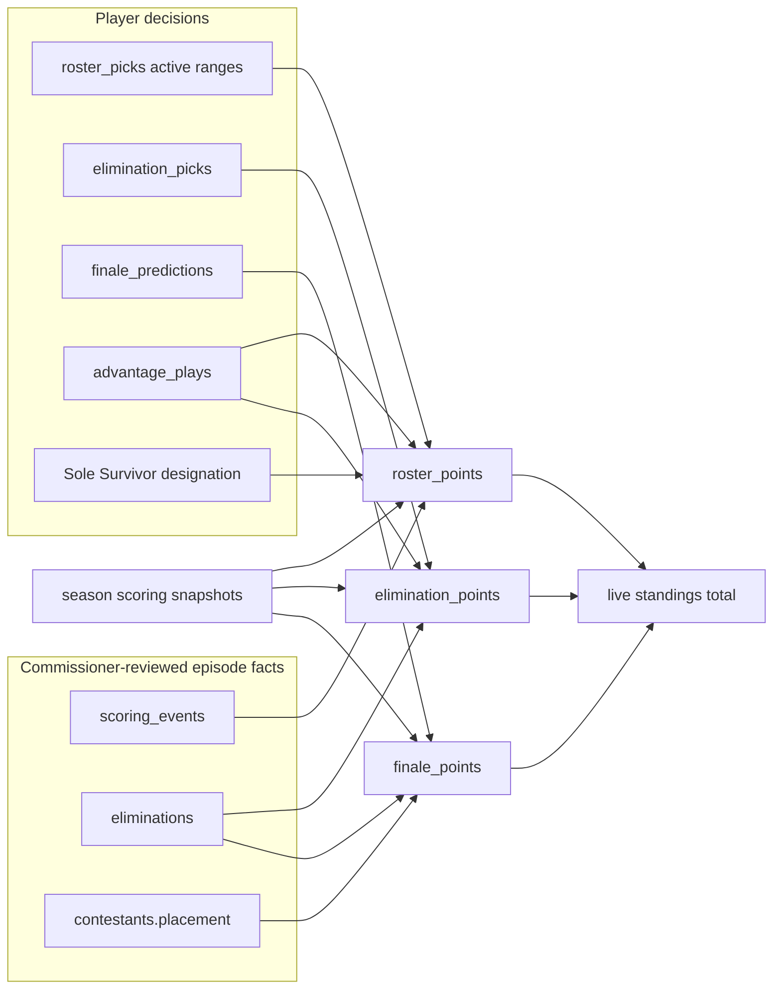

# Scoring computation flow

Standings are calculated live from stored facts and player decisions. There is
no score cache, score total column, or scoring materialized view. The executable
source is [`../backend/app/scoring.py`](../backend/app/scoring.py), exposed by
[`../backend/app/routers/standings.py`](../backend/app/routers/standings.py).

## The three standings components

### Roster points

Each `scoring_events` row is joined to the users who rostered that contestant
during that episode. `roster_picks.active_from_episode` and
`active_until_episode` preserve swaps without moving previously earned points.
The event's season-snapshot value is selected at scoring time; a configured
post-merge value applies when `episode_number >= seasons.merge_episode`, and
per-unit events multiply by `quantity`. `merge_episode` is set by the
commissioner when scoring the episode of the first individual Tribal Council —
the vote that sends the first player to the jury; until then everything is
pre-merge (decision #10).

Double Castaway Points adds one extra copy of the targeted roster member's event
points for that episode. At the finale, the active Sole Survivor designee adds
50% of that castaway's complete finale roster contribution, rounded once after
the events are summed. Placement is not a separate standings component:
placement changes create ordinary finale scoring events through the triggers in
`20260811000000_placement_events_trigger.sql`.

Historical `roster_picks.swap_penalty_points` values are still summed. New
weekly-play swaps write no point penalty.

### Ballot points

For non-finale episodes, each `elimination_picks` row scores when the same
contestant appears in that episode's `eliminations`. Incorrect picks score
zero.

The ballot is a ladder (#694): `elimination_picks.rank` is the name's rung,
1 = most confident, written from the order of the picks POST. A ranked pick
pays the season's `correct_elimination_<rank>` snapshot value (live template:
20 / 16 / 12 before the merge, 25 / 20 / 15 after). A pick with no rank, or a
season whose snapshot has no rung keys, pays the flat `correct_elimination`
value as before. `scoring.PICK_VALUE_JOIN_SQL` / `PICK_BASE_SQL` carry that
branch for every ballot query.

Power Vote (advantage_type `double_vote_points`, #673, valued #694) adds one
extra name above the ladder, named by `target_contestant_id` and stored as a
pick with no rank. If it hits it pays the season's `power_vote` value (32 / 38)
instead of its rung; a season with no `power_vote` key doubles the flat value.
Pre-#673 plays (#303) carry no target and instead double the entire correct
ballot total; those completed seasons keep scoring that way (#170). Pick
results report the base value and the play's bonus separately (#136), so the
bonus is `power_vote` less the base.

### Finale ballot points

`finale_predictions` stores the three independent finale calls: early boot,
fire-making loss, and winner. They resolve against finale `eliminations` and
the winning contestant's placement using the season's prediction snapshot.
Finale placement points earned by tribe members remain tribe points, not
finale-ballot points.

## Reconciliation and presentation

`get_standings` sums `roster_points + elimination_points + finale_points` for
each non-admin league member. `episode_points` calculates the same rules for one
episode; subtracting the latest scored episode from current totals produces the
rank trend. The invariant tests verify that episode contributions reconcile to
the season total.

Player-facing breakdowns deliberately separate base roster earnings, base
ballot earnings, and the attributable weekly-play bonus. Helpers such as
`roster_points_by_contestant`, `elimination_pick_results`, and
`advantage_bonus_by_play` exist for that explanation; they do not store a
second score.

## Episode Reveal insights

After scoring, the commissioner may select up to three editorial facts for an
episode's Reveal and history replay. No selection means no insight module. The
supported facts are:

- Pick popularity for a named castaway eliminated in that non-finale episode:
  the share of submitted ballots that included them.
- Submitted ballots with at least two correct elimination picks.
- The viewer's episode score versus the median among season participants.
- League usage of Double Castaway Points, Power Vote, or Tribe Swap.

Configuration contains no aggregate values. Facts are calculated only through
the authenticated scored-result endpoint and expose counts or percentages,
never another player's ballot or identity.

## Historical-season guarantees

- Existing seasons read `season_scoring_event_types` and
  `season_prediction_score_types`, never newly tuned global template values.
  A season still being played can be opted into a retune by a migration that
  re-copies the templates into its snapshot; because nothing caches a score,
  already-scored episodes recompute at the new values on the next read. Only
  `status = 'active'` seasons are ever refreshed this way — completed seasons
  stay time capsules.
- Disabled event types are blocked from new entry but recorded events continue
  to score. Disabling is not retroactive.
- Effective roster ranges, historical swap penalties, old targeted doubles,
  and the token ledger remain intact.
- `token_economy_enabled` controls whether a season is presented under the
  historical token rules or the current one-play-per-episode rules.

Configured point values belong in the database and the Rules API, not in this
document. See the latest migrations and the product history for why a value or
mechanic changed.
